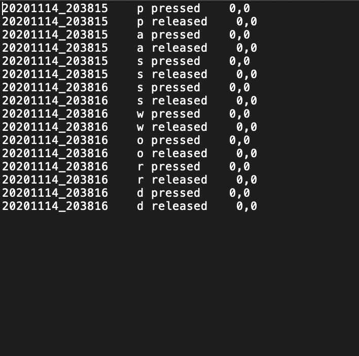
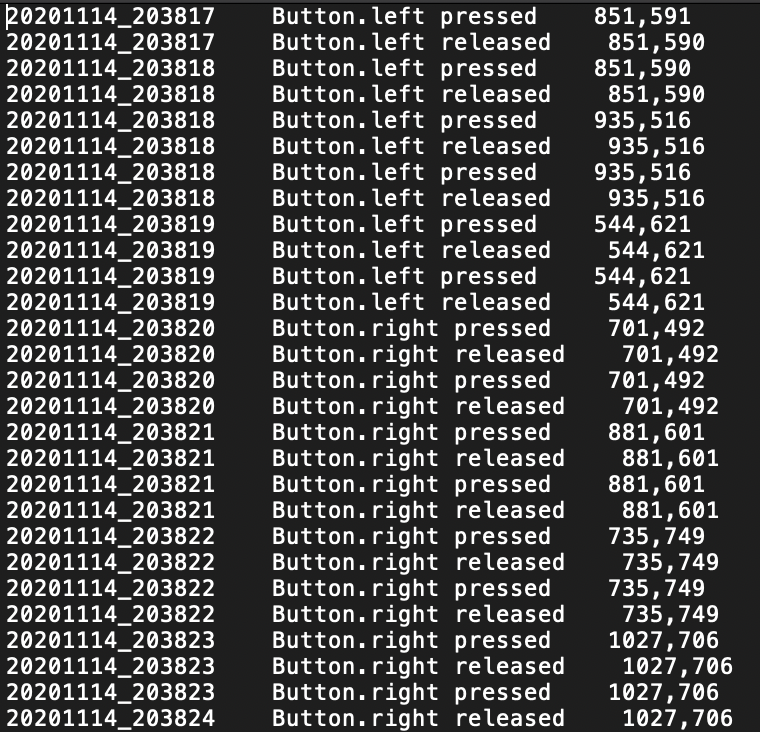

# Input Logger
<p align="center"></p>

Nowadays people often download software from the internet. While downloading or using software from the Internet, people may not fully know what's going on under the table. A program may seems like not harmful at the first glance, but actually runs malicious functions secretly to steal users' sensitive information.

The project implements a logging program to record user input from a victim computer. The program first records keyboard input, mouse input, screenshot and audio input, and store them as log files.

The main purpose of this project is warning people be aware of what kind of software they are using. For example, when using a real-time streaming service, we way want to know whether our audio is recorded and sent to the software provide. Or when we are typing text on a message tab, is it possible some malicous program is secretly recording the key log, and later extract your email, name, password from it.


## Getting Started


### Prerequisites

> - Pillow <a href='https://pillow.readthedocs.io/en/stable/'>source    </a>
> - pynput <a href='https://pypi.org/project/pynput/'>source    </a>
> - pyscreenshot <a href='https://pypi.org/project/pyscreenshot/'>source    </a>
> - pyaudio <a href='https://pypi.org/project/PyAudio/'>source    </a>

### Installing

1. Download the project from github:
`git clone https://github.com/yuan64198/InputLogger.git`

2. Install the packages:
- Option 1:
    - Install PIL: `pip install Pillow==2.2.1`
    - Install pynput: `pip install pynput`
    - Install pyscreenshot: `pip install pyscreenshot`
    - Install Pyaudio: `pip install PyAudio`
- Option 2 (conda):
    - Move to the project directory: `cd InputLogger`
    - Create new conda environment: `conda create --name <env> --file requirements.txt`


### Running the tests
1. Start logging user input: `python main.py start`
2. Remove all log files: `python main.py clean`


#### Log Options
##### Text format:
`<timestamp><button_clicked><action><coordinateX,coordinateY>`
##### Json format:
```
{
    records: [
        {
            button: button1,
            coordinates: [coordinateX,coordinateY],
            is_on_press: True/False,
            timestamp: ts
        }
        {
            button: button2,
            coordinates: [coordinateX,coordinateY],
            is_on_press: True/False,
            timestamp: ts
        }
        .
        .
        .
        {
            button: buttonN,
            coordinates: [coordinateX,coordinateY],
            is_on_press: True/False,
            timestamp: ts
        }
    ],
    timestamp: ts
}
```

### Samples
> - sample1


> - sample2



### Customize the logger in constants.py

#### Log Format
DEFAULT_LOG_MODE = 'json'

#### Mouse Logger
> - ENABLE_MOUSE = True
> - MOUSE_LOG_FILENAME = 'mouse_log'
> - MOUSE_LOG_INTERVAL = 10
> - MOUSE_LOG_ON_PRESS = True
> - MOUSE_LOG_ON_RELEASE = True

#### Keyboard Logger
> - ENABLE_KEYBOARD = True
> - KEYBOARD_LOG_FILENAME = 'keyboard_log'
> - KEYBOARD_LOG_INTERVAL = 10
> - KEYBOARD_LOG_ON_PRESS = True
> - KEYBOARD_LOG_ON_RELEASE = True

#### Screenshot Logger
> - ENABLE_SCREENSHOT = True
> - SCREENSHOT_FILENAME = 'screenshot'
> - SCREENSHOT_INTERVAL = 2
> - IMAGE_RESIZE = False
> - IMAGE_WIDTH = 800

#### Audio Logger
> - ENABLE_AUDIO = True
> - AUDIO_LOG_FILENAME = 'audio_log'
> - CHUNK = 1024
> - NUM_CHANNEL = 1
> - FS = 44100
> - AUDIO_LOG_INTERVAL = 10
> - PROGRAM_LIFETIME = 3
> - FILE_CHECKING_INTERVAL = 1

#### Log Directory
> - AUDIO_DIR = './audio/'
> - IMAGE_DIR = './img/'
> - LOG_DIR = './log/'


## Authors
* **Chih-Yuan Huang** - [Peronal Page](https://yuan64198.github.io/) - [LinkedIn](https://www.linkedin.com/in/chih-yuan-huang/)
